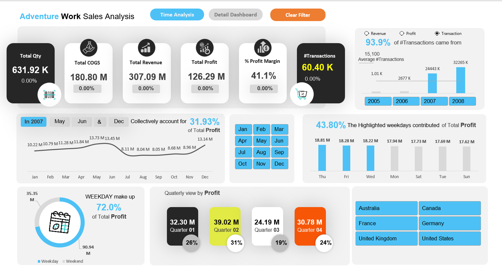
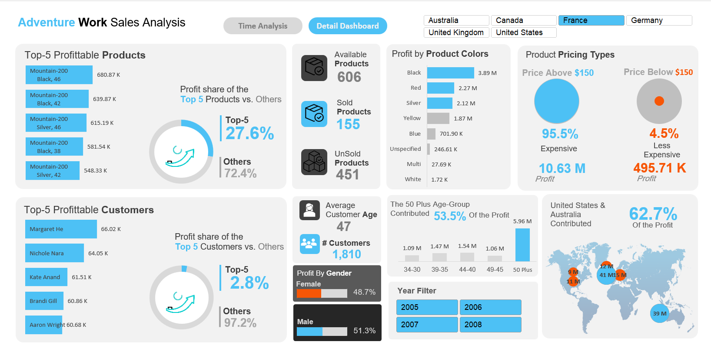

# 📊 Adventure Works Sales Analysis | Advanced Excel Dashboard

## Overview
This project is an interactive Excel Dashboard built to analyze sales performance, customer demographics, pricing strategy, and regional profitability for Adventure Works. The dashboard enables dynamic data exploration and filtering to support data-driven decision-making.

---

## Features
* **Multi-Tab Dashboard:** Dynamic navigation between **Time Analysis** and **Detail Dashboard** views.
* **Customer Demographic Profiling:** Analyzing profitability across customer age groups and genders.
* **Product & Pricing Insights:** Evaluating performance based on pricing tiers and active vs. unsold product counts.
* **Geographic Mapping:** Visualizing regional sales contributions across global markets.
* **Interactive Slicers:** Dynamic filtering by Year, Month, Days of the Week, and Country.
* **Custom UI/UX:** Built with dedicated KPI cards, toggle buttons, and a clean layout.

---

## Dashboard Preview

### 1. Time Analysis View

### 2. Detail Analysis View

---

## Dynamic Key Metrics
* **Total Sales Revenue & Operating Profit**
* **Total Quantity Sold & Transaction Volume**
* **Profit Margin Percentage (% Profit Margin)**
* **Active vs. Unsold Product Counts**
* **Customer Demographics & Age Distribution**

---

## Business Insights & Questions Answered
* **Seasonal & Time Trends:** Tracks monthly and quarterly profit movements to identify peak sales periods.
* **Demographics Driving Revenue:** Highlights which age brackets and genders generate the highest profitability.
* **Weekday vs. Weekend Performance:** Compares transaction volume and profits based on days of the week.
* **Product Profitability:** Identifies top-performing products, overall product color distribution, and the impact of price points (Above vs. Below $150).
* **Regional Breakdown:** Maps sales and profit distribution across global territories (e.g., US, Australia, European markets).

---

## Tools & Concepts Used
* **Microsoft Excel:** Pivot Tables, Pivot Charts, Data Modeling, Custom Formulas.
* **Data Visualization:** Custom Color Schemes, KPI Cards, Conditional Formatting.
* **Interactivity:** Slicers, Dashboard Navigation Buttons, Dynamic Filtering.
